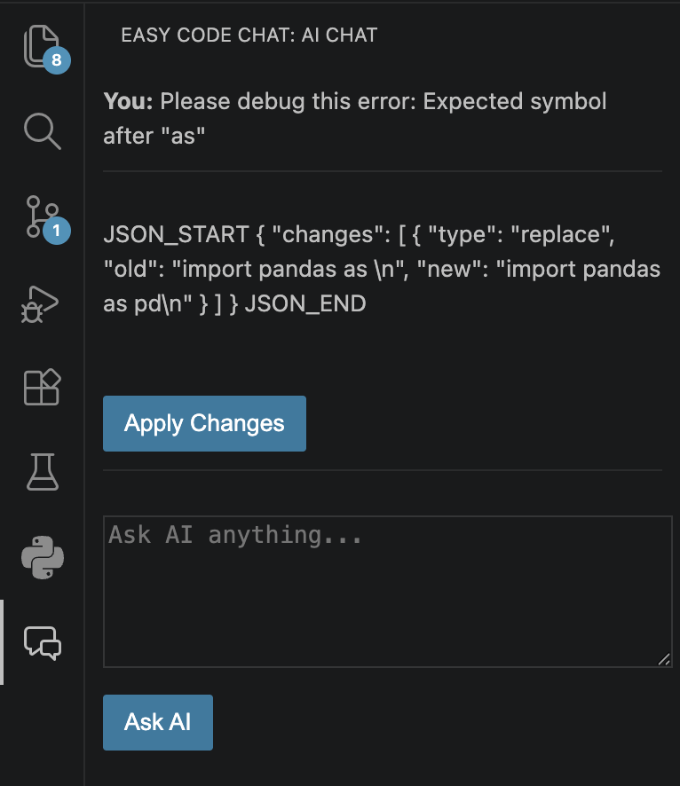
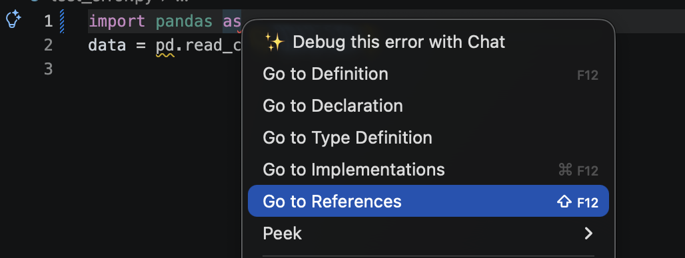
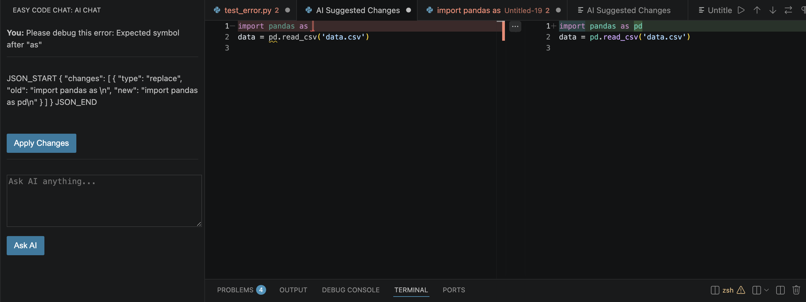
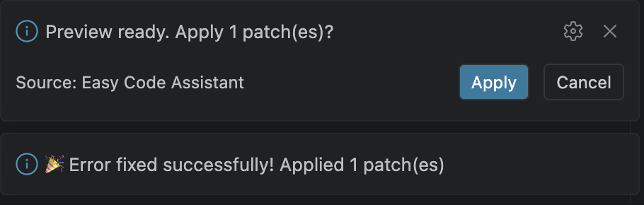

# 🚀 EasyCode AI


> **Offline AI Coding Assistant for Visual Studio Code**

An intelligent offline coding assistant that integrates directly into **Visual Studio Code**, helping developers debug, understand, and automatically fix code using a **locally running Large Language Model (LLM)** through **LM Studio**.

Unlike cloud-based assistants, **EasyCode AI** works completely offline, giving you faster development, lower cost, and complete privacy.

---

# ✨ Features

## 🤖 AI Chat

Ask programming questions directly inside VS Code.

Examples:

* Explain async/await
* What is dependency injection?
* How does FastAPI work?
* Explain this code

---

## 🐞 Debug with AI

Click **Debug with Chat** on any compiler error or warning.

EasyCode AI automatically:

* Collects diagnostics
* Extracts surrounding code
* Sends the context to the local LLM
* Generates an explanation
* Suggests fixes

---

## 🧩 AI Patch Generation

Instead of only explaining the issue, the assistant generates structured patches describing exactly what should change.

Supported operations:

* Replace
* Delete
* Insert Before
* Insert After

---

## 🔍 Patch Preview

Before modifying your source code, EasyCode AI opens a **VS Code Diff Preview**, allowing you to review every change.

No code is modified automatically.

---

## ✅ One-click Apply

After reviewing the diff:

* Click **Apply**
* Changes are written into your file
* File is formatted automatically
* Diagnostics are rechecked

---

## 📡 Streaming Responses

Responses are streamed token-by-token for a smoother user experience.

---

## 🔒 Fully Offline

No cloud APIs.

No internet required.

All inference happens locally using:

* LM Studio
* Local GGUF / MLX models

---

# 📸 Screenshots

## AI Chat



---

## Quick Fix Action



---

## Diff Preview



---

## Successful Fix



---

# 🏗 Architecture

```text
                    +------------------------+
                    |    Visual Studio Code  |
                    +-----------+------------+
                                |
                                |
                     VS Code Extension
                                |
                                |
                    +-----------v------------+
                    |     Extension.ts       |
                    +-----------+------------+
                                |
                 HTTP Streaming Requests
                                |
                                |
                    +-----------v------------+
                    |      Flask Server      |
                    +-----------+------------+
                                |
                    OpenAI Compatible API
                                |
                                |
                    +-----------v------------+
                    |       LM Studio        |
                    +-----------+------------+
                                |
                    Local LLM (Offline)
                                |
             Qwen / Gemma / DeepSeek Coder
```

---

# ⚙️ Tech Stack

## Frontend

* Visual Studio Code Extension API
* TypeScript
* HTML
* JavaScript

## Backend

* Python
* Flask

## AI

* LM Studio
* OpenAI Compatible API

## Models

Tested with:

* Qwen2.5-Coder-3B
* Qwen2.5-Coder-14B
* Gemma 12B

---

# 📂 Project Structure

```text
EasyCode_AI/

│
├── app.py
├── requirements.txt
├── README.md
│
├── easy-code-assistant/
│   ├── src/
│   │    └── extension.ts
│   │
│   ├── webview/
│   │    └── chat.html
│   │
│   ├── package.json
│   └── tsconfig.json
│
└── docs/
    └── images/
```

---

# 🚀 Installation

## 1. Clone

```bash
git clone https://github.com/Monimarcol/Easy_code_assistant.git
```

---

## 2. Install Python Dependencies

```bash
pip install -r requirements.txt
```

---

## 3. Install Extension Dependencies

```bash
cd easy-code-assistant

npm install
```

---

## 4. Compile Extension

```bash
npm run compile
```

---

## 5. Package Extension

```bash
npx @vscode/vsce package
```

---

## 6. Install VSIX

Inside VS Code:

Extensions

→

Install from VSIX

---

## 7. Start Backend

```bash
python app.py
```

---

## 8. Start LM Studio

Load any supported coding model.

Example:

* Qwen2.5-Coder-3B-Instruct
* Qwen2.5-Coder-14B-Instruct

Start the local server.

---

# 💻 Usage

### Chat

Ask:

```
Explain async await
```

---

### Debug

Click

```
💡 Debug with Chat
```

The assistant:

* Reads diagnostics
* Collects nearby code
* Generates explanation
* Generates patch
* Shows Diff Preview
* Applies fix

---

# 📈 Current Features (v1.0.0)

* Offline AI Chat
* Debug Compiler Errors
* AI Patch Generation
* Patch Preview
* One-click Apply
* Automatic Formatting
* Diagnostics Verification
* Streaming Responses
* Local LLM Integration

---

# 🛣 Roadmap

## ✅ Version 1.0.0

Current release.

---

## 🚀 Version 1.1.0

* Multi-error fixing
* Fix all diagnostics in one pass

---

## 🚀 Version 1.2.0

* Workspace indexing
* Multi-file understanding
* Related file context

---

## 🚀 Version 1.3.0

* Automatic verification
* Retry failed fixes
* Better patch matching

---

## 🚀 Version 2.0.0

Full Repository AI Assistant

Features planned:

* Project-wide code understanding
* Repository chat
* AI Refactoring
* AI Code Generation
* AI Documentation
* AI Unit Test Generation
* AI Commit Message Generator

---

# 🤝 Contributing

Contributions, feature ideas, and bug reports are welcome.

Feel free to open an Issue or Pull Request.

---

# 👨‍💻 Author

**Moni Marcol**

AI / ML Engineer

GitHub:

https://github.com/Monimarcol

---

# 📄 License

This project is licensed under the MIT License.
